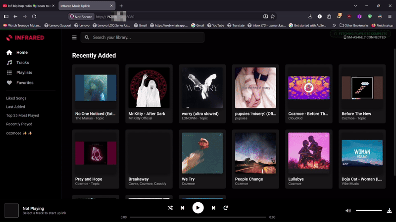
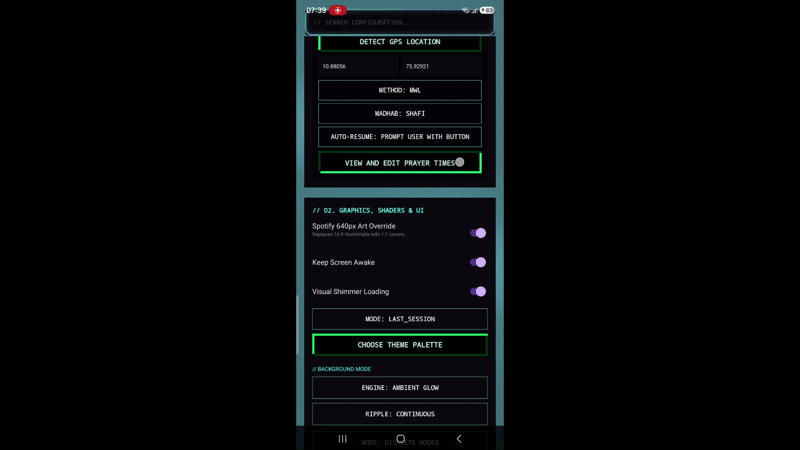
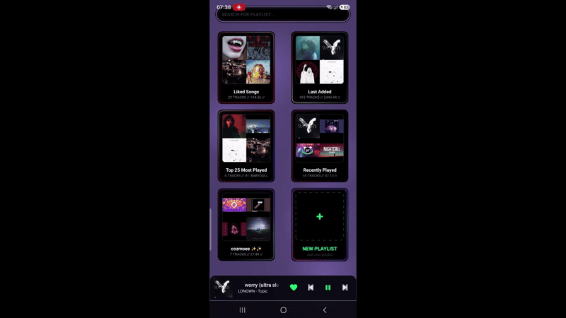

# Infrared Music

The project had began as a personal tool, and a work in progress.

---

## Video Demonstration

  <a href="https://www.youtube.com/watch?v=YJoHNKigPSs">
    
     
    <b>▶ Watch Full 4-Minute Technical Walkthrough & Web Uplink Demo</b>
  </a>

---

## Feature Showcases

  <table>
    <tr>
      <td align="center" width="50%">
        <b>Ktor Browser Uplink (Background Playback)</b>  
        
          
        <i>Host an in-browser streaming player directly on your PC over LAN with 0 cloud accounts.</i>
      </td>
      <td align="center" width="50%">
        <b>AGSL Fluid Mesh & Visual Kinetics</b>  
        
          
        <i>Real-time Simplex noise and discrete node canvas rendering responsive to transient audio.</i>
      </td>
      <td align="center" width="50%">
        <b>Reactive Song Art Colors</b>  
        
          
        <i>Displaying how the background audio reactor engine dynamically changes with each song according their album art.</i>
      </td>
    </tr>
  </table>

---

## Static Previews

  <table>
    <tr>
      <td align="center" width="33%">
        <b>Library</b>  
        
      </td>
      <td align="center" width="33%">
        <b>Web Interface</b>  
        
      </td>
      <td align="center" width="33%">
        <b>Now Playing</b>  
        
      </td>
    </tr>
    <tr>
      <td align="center" width="33%">
        <b>Search</b>  
        
      </td>
      <td align="center" width="33%">
        <b>Home Page</b>  
        
      </td>
      <td align="center" width="33%">
        <b>Settings</b>  
        
      </td>
    </tr>
  </table>

---

## What Problem This Solves

This was developed to allow direct music downloads and local network streaming without relying on third-party web tools, cloud lock-in, or ad-riddled download portals.

## Core Capabilities

* **Ktor Wi-Fi Uplink & Hero Player:** Host a local HTTP streaming server on port `:8080` straight from your Android device. Streams music directly to desktop browsers with full background playback support while your phone screen is off.
* **AGSL Shaders & Fluid Kinetics:** Procedural Simplex noise field and configurable floating glow orbs syncing dynamically to low-frequency audio transients.
* **Discord Rich Presence:** Real-time playback status synchronization to Discord desktop via a local IPC daemon.
* **Declarative Provider Dispatcher:** Multi-platform metadata and audio resolution with automated endpoint health failover.
* **Hardware-Inspired Scrubber:** Micro-wire interpolated 60 FPS scrubber with zero-latency position updates.
* **Network & Power Controls:** Strict Wi-Fi restrictions, auto-throttle under low battery, and charge-only download safeguards.
* **Auto-Updater:** Direct release checks against GitHub Releases. (somewhat broken at the moment, Im working on fixing it. Until this is fixed, please download the latest APK files from Releases)

## Download

You can download the latest release APK directly from [GitHub Releases](https://github.com/infrared-o8/ir_mus/releases).

## Project Status

The app is under active development. Some modules (advanced audio DSP parameters, theme recoloring, and full accessibility profiles) are still evolving.

Bug reports, feature suggestions, and pull requests are welcome via GitHub Issues or contact channels below:

* **Email:** infraredo979@gmail.com
* **Telegram:** [@infr466](https://t.me/infr466)
* **WhatsApp:** +91 70126 38570 *(Available for early tester codes)*
