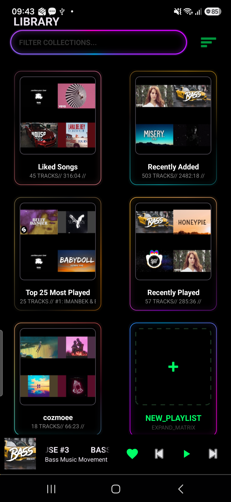
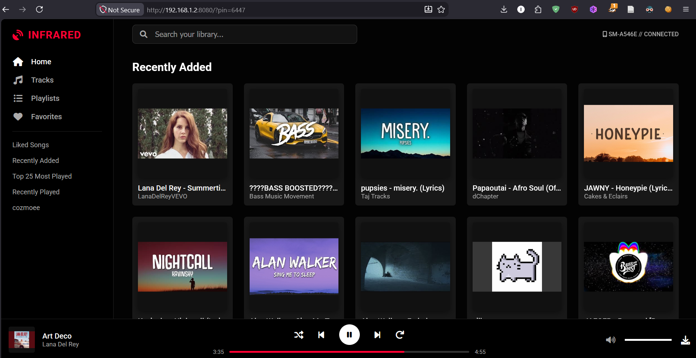
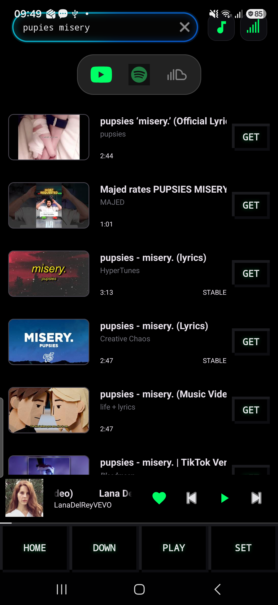
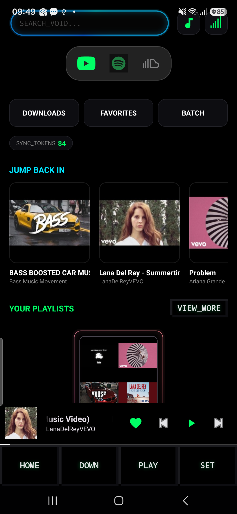
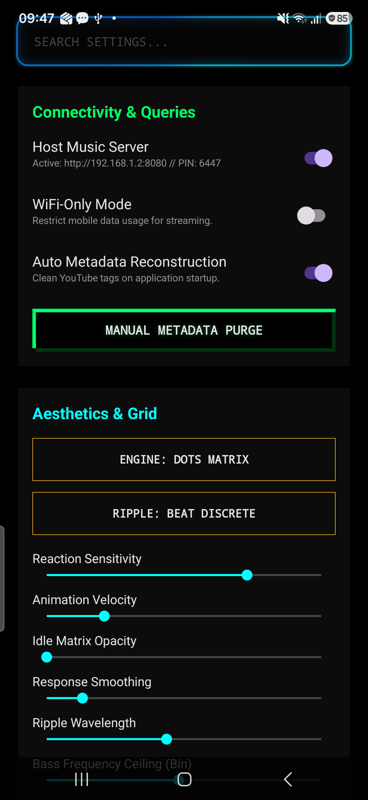

# Infrared Music

The project began as a personal tool and is now maintained as a public repository.

## Preview

  <table>
    <tr>
      <td align="center" width="33%">
        <b>Library</b>  
        
      </td>
      <td align="center" width="33%">
        <b>Web Interface</b>  
        
      </td>
      <td align="center" width="33%">
        <b>Now Playing</b>  
        
      </td>
    </tr>
    <tr>
      <td align="center" width="33%">
        <b>Search</b>  
        
      </td>
      <td align="center" width="33%">
        <b>Home Page</b>  
        
      </td>
      <td align="center" width="33%">
        <b>Settings</b>  
        
      </td>
    </tr>
  </table>

---

## What Problem This Solves

This was developed to allow direct music downloads and local network streaming without relying on third-party web tools or ad-riddled download portals.

## Features

* **Real-Time Audio Reactive Matrix:** Procedural polka-dot visualizer with discrete wave kinetics synced to transient bass kicks.
* **Ktor Wi-Fi Uplink:** Turn your device into a localized media server to stream and browse your music library directly on your desktop browser.
* **Discord Rich Presence:** Real-time playback status synchronization to Discord desktop via a local IPC daemon.
* **Search & Suggestions:** Seamless querying with dynamic search completions.
* **Queue-Based Download Engine:** Fault-tolerant downloads with automatic retries, batch queuing, and playlist extraction.
* **Hardware-Inspired Scrubber:** Micro-wire interpolated 60 FPS scrubber with zero-latency scrubbing.
* **Network & Storage Controls:** Wi-Fi only restriction flags, cache limits, and direct file-sharing from within the app.
* **Auto-Updater:** Direct release checks against GitHub Releases.

## Download

You can download the latest release APK from [Releases](https://github.com/infrared-o8/ir_mus/releases).

## Project Status

The app is under active development. Some modules (advanced audio DSP parameters, theme recoloring, and full accessibility profiles) are still in progress.

Please keep in mind that this is an evolving build. Bug reports, feature suggestions, and pull requests are welcome via GitHub Issues or contact channels below.

* **Email:** infraredo979@gmail.com
* **Telegram:** [@infr466](https://t.me/infr466)
* **WhatsApp:** +91 70126 38570 *(Available for early tester codes)*
